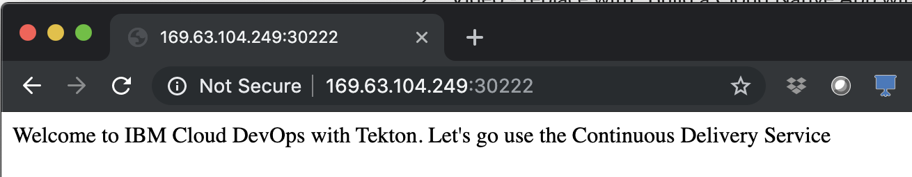

# Setup CI/CD Pipelines on Managed OpenShift with IBM Cloud Continuous Delivery

**This lab is adapted from the IBM Garage Method tutorial <a href="" target="_blank">Develop a Kubernetes app by using Tekton delivery pipelines</a>, to work on IBM Cloud Managed OpenShift.**

In this lab, you will create an open toolchain that includes a Tekton-based delivery pipeline. You then use the toolchain and DevOps practices to develop a simple "Hello World" web application (app) that you deploy to an <a href="https://www.ibm.com/cloud/openshift" target="_blank">IBM Cloud™ Managed OpenShift</a> cluster. 

<a href="https://www.ibm.com/cloud/blog/tekton-a-modern-approach-to-continuous-delivery" target="_blank">Tekton</a> is an open source, vendor-neutral, Kubernetes-native framework that you can use to build, test, and deploy apps across a range of environments. Tekton provides a set of shared components for building <a href="https://www.ibm.com/cloud/learn/continuous-integration" target="_blank">continuous integration</a> and <a href="https://www.ibm.com/cloud/learn/continuous-delivery" target="_blank">continuous delivery</a> (CI/CD) systems. As an open source project, Tekton is managed by the <a href="https://cd.foundation/" target="_blank">Continuous Delivery Foundation (CDF)</a>. The goal is to modernize continuous delivery by providing industry specifications for pipelines, workflows, and other building blocks. With Tekton, you can build, test, and deploy across cloud providers or on-premises systems by abstracting the underlying implementation details. Tekton pipelines are built in to <a href="https://www.ibm.com/cloud/blog/announcements/build-and-deliver-using-tekton-enabled-pipelines" target="_blank">IBM Cloud™ Continuous Delivery</a>.

## Prerequisites

1. You must have an **IBM Cloud account**. The account is free and provides access to everything that you need to develop, track, plan, and deploy apps. <a href="https://cloud.ibm.com/registration" target="_blank">Sign up for a trial</a>. The account requires an IBMid. If you don't have an IBMid, you can create one when you register.

2. You need a **Managed Red Hat OpenShift cluster**. You can create it by using either the UI or the command-line interface (CLI).

   a. Go to the <a href="https://cloud.ibm.com/catalog?category=containers&search=kubernetes" target="_blank">Container Services catalog entry</a>. 

   b. Click **Red Hat OpenShift Cluster**.
   
   c. On the Red Hat OpenShift Cluster page, click **Create**. On the "Create a new OpenShift cluster" page, select the options you would like, and click **Create Cluster**. For more information, see the <a href="https://cloud.ibm.com/docs/openshift?topic=openshift-getting-started" target="_blank">IBM Cloud documentation</a>. 
   
3. **Optional** Install the IBM Cloud and OpenShift CLIs. 

   a. To install the **IBM Cloud CLI**, see <a href="https://cloud.ibm.com/docs/cli?topic=cloud-cli-install-ibmcloud-cli" target="_blank">Installing the stand-alone IBM Cloud CLI</a>.
   
   b. To install the **OpenShift CLI**, see <a href="https://cloud.ibm.com/docs/openshift?topic=openshift-openshift-cli" target="_blank">Installing the OpenShift CLI</a>

4. Once your cluster is created, you need to add a **registry namespace** either via the Web Console, or via the IBM Cloud CLI.
   
   a. To add a new namespace from the CLI, type the following command: `ibmcloud cr namespace-add <namespace>` where `<namespace>` is your new registry namespace name.
   
   b. Alternatively, from the <a href="https://cloud.ibm.com/" target="_blank">IBM Cloud Web Console</a>, select **OpenShift** from the top left navigation menu, then select **Registry**. Click on **Namespaces** then **Create Namespace**.

4. You need to create an **IBM Cloud API key**. To create a key, go to Manage-->Access--><a href="https://cloud.ibm.com/iam/apikeys?cm_mmc=IBMBluemixGarageMethod-_-MethodSite-_-10-19-15::12-31-18-_-api-keys" target="_blank">IBM Cloud API keys</a> and click **Create an IBM Cloud API key**. Enter a Name and Description pertaining to the key. 

   **Important**: Save the API key value by either copying or downloading it. You need it when you create your toolchain. For more information about creating a cluster by using the CLI, see the <a href="https://cloud.ibm.com/docs/containers?topic=containers-clusters#clusters_cli" target="_blank">Creating clusters with the IBM Cloud CLI</a> tutorial. For more information about the IBM Cloud Container Registry service, see the <a href="https://cloud.ibm.com/docs/services/Registry?topic=registry-index#index" target="_blank">IBM Cloud documentation</a>.

## Task 1: Create a Toolchain with Tekton Pipelines

In this task, you create a toolchain and add the tools that you need for this tutorial. Before you begin, you need your API key and OpenShift cluster name.

1. Create your toolchain by following one of these options:

   a. Open the toolchain creation page by clicking **Create toolchain**.
   
       

   b. Go to <a href="https://cloud.ibm.com/?cm_mmc=IBMBluemixGarageMethod-_-MethodSite-_-10-19-15::12-31-18-_-ibm-bluemix-website" target="_blank">cloud.ibm.com</a>. Open the menu in the upper-left corner and click **DevOps**. Click **Create a Toolchain**. Select **Build Your Own Toolchain**. 
   
      
   
   c. If you already have an OpenShift cluster, go to <a href="https://cloud.ibm.com/?cm_mmc=IBMBluemixGarageMethod-_-MethodSite-_-10-19-15::12-31-18-_-ibm-bluemix-website" target="_blank">cloud.ibm.com</a>. Open the menu in the upper-left corner and click **OpenShift**. Click **Clusters** and click your cluster. On the cluster dashboard, click the **DevOps** tab and click **Create a Toolchain**. Select **Build Your Own Toolchain**. 
   
   **Tip:** For instructions to navigate to the toolchain templates and select a toolchain to create, see <a href="https://cloudcontent.mybluemix.net/cloud/garage/tutorials/toolchain_nav" target="_blank">Navigating to the toolchain templates</a>.

2. On the "Build your own toolchain" page, review the default information for the toolchain settings. The toolchain's name identifies it in IBM Cloud. Make sure that the toolchain's name is unique within IBM Cloud. Each toolchain is associated with a specific region and resource group. From the menus on the page, select the region and resource group where you want to create the toolchain. You can have up to 200 toolchains per resource group. 

   **Note**: In order to use the IBM Managed pipeline worker, you must select Dallas as the region for the toolchain.

   

   If you want to switch to a different account, click the profile avatar icon on the banner and select the account. For the purposes of this lab, make sure the Dallas region is selected.

3. Click **Create**. The blank toolchain is created.

   

4. Click **Add a Tool** and select **Git Repos and Issue Tracking**.

   

   a. From the Repository type list, select **Clone**.

   b. In the Source repository URL field, type https://github.com/stevenjweaver/hello-tekton.

   c. Make sure that the **Make this repository private** checkbox is *unchecked*, and the **Track deployment of code changes** checkbox is *checked*. 

   

   d. Click **Create Integration**. Tiles for Git Issues and Git Code are added to your toolchain.

5. Return to your toolchain's overview page.

   **Note**: For this tutorial, we will be using the managed pipeline worker provided by the Continuous Delivery service in Dallas. If you would prefer to create your own private pipeline worker, you can follow the steps in the Optional Task 3 below.

6. Click **Add a Tool** and click **Delivery Pipeline**.

   a. Type a name for your new pipeline.

   b. Select **Tekton** from the **Pipeline type** dropdown.  
   
   
   
   c. Make sure that the **Show apps in the View app menu** checkbox is selected. All the apps that your pipeline creates are shown in the View App list on the toolchain's Overview page.

   d. Click **Create Integration** to add the Delivery Pipeline to your toolchain.

7. Click the Delivery Pipeline tile to open the Tekton Delivery Pipeline dashboard. The **Configure Pipeline** page will open. Select the **Definitions** tab and click **Add** to select your repository:

   a. Specify the Git repo and URL that contains the Tekton pipeline definition and related artifacts. From the list, select the Git repo that you created earlier.

   b. Select the branch in your Git repo that you want to use. For this tutorial, use the default value.

   c. Specify the path to your pipeline definition within the Git repo. You can reference a specific definition within the same repo. For this tutorial, use the default value.  

   d. Click **Save**.
   
   

8. Click the **Worker** tab and select the **IBM Managed workers in DALLAS** pipeline worker. If you are using a private pipeline worker, select the one that you want to use to run your Tekton pipeline on the associated cluster. 

   

9. Click the **Triggers** tab and click **Add trigger** and click **Git Repository**. Associate the trigger with an event listener: 

   a. From the Repository list, select your repo.

   b. Select the **When a commit is pushed** checkbox, and make sure that *listener* is selected in the EventListener field.

   c. Click **Save**.  
   
   

10. On the **Triggers** tab, click **Add trigger** and click **Manual**. Associate that trigger with an event listener:

    a. Make sure that listener is selected in the EventListener field.

    b. Click **Save**. 
   
    

    **Note**: Manual triggers run when you click Run pipeline and select the trigger. Git Repository triggers run when the specified Git event type occurs for the specified Git repo and branch. The list of available event listeners is populated with the listeners that are defined in the pipeline code repo. 

11. Click the **Environment properties** tab and define the environment properties for this tutorial. To add each property, click **Add property** and select **Text property** (unless specified otherwise below). Add these properties:

    * **apikey**: Type the API key that you created earlier in this tutorial. (You can make this a **Secure Property** if you would like to hide the API Key)
    
    * **cluster**: Type the name of the OpenShift cluster that you created.
    
    * **clusterNamespace**: Type the project in your OpenShift cluster where the app will be deployed. The default is `default`, but to see a list of your current projects, at a command line, type `oc project list`.
    
    * **clusterRegion**: Type the region where your OpenShift cluster is located. This will be the region in which you created your OpenShift cluster. To find your region, type `oc version` at a command line. The `Server` line will include the region as part of the cluster URL.
    
    * **registryNamespace**: Type the IBM Cloud Container Registry namespace where the app image will be built and stored. To use an existing namespace, use the CLI and run `ibmcloud cr namespace-list` to identify all your current namespaces. 
    
    * **registryRegion**: Type the region where your IBM Cloud Container Registry is located. The default is US-South. To find your registry region, use the CLI and run `ibmcloud cr region`.
    
    * **repository**: Type the source Git repository where your resources are cloned. This is the Git repository we cloned when we build the toolchain.

16. Click **Save** and then **Close**. Your toolchain is now set up.

    

## Task 2: Explore the pipeline

With a Tekton-based delivery pipeline, you can automate the continuous building, testing, and deployment of your apps. The **Tekton Delivery Pipeline** dashboard displays an empty table until at least one Tekton pipeline runs. After a Tekton pipeline runs, either manually or as the result of external Git events, the table lists the run, its status, and the last updated time of the run definition.

To run the manual trigger that you set up in the previous task, click **Run pipeline** and select the name of the manual trigger that you created. The pipeline starts to run and you can see the progress on the dashboard. 

   

Pipeline runs can be in any of the following states:

* **Pending**: The PipelineRun definition is queued and waiting to run.

* **Running**: The PipelineRun definition is running in the cluster.

* **Succeeded**: The PipelineRun definition was successfully completed in the cluster.

* **Failed**: The PipelineRun definition run failed. Review the log file for the run to determine the cause.  

   

For more information about a selected run, click any row in the table. You view the Task definition and the steps in each PipelineRun definition. You can also view the status, logs, and details of each Task definition and step, and the overall status of the PipelineRun definition.
  
   

The pipeline definition is stored in the `pipeline.yaml` file in the `.tekton` folder of your Git repository. Each task has a separate section of this file. The steps for each task are defined in the `tasks.yaml` file.

1. Review the **pipeline-build-task**. The task consists of a git clone of the repository followed by two steps:

   * *pre-build-check*: This step checks for the mandatory Dockerfile and runs a lint tool. It then checks the registry current plan and quota before it creates the image registry namespace if needed.

   * *build-docker-image*: This step creates the Docker image by using the <a href="https://www.ibm.com/cloud/container-registry" target="_blank">IBM Cloud Container Registry</a> build service through the `ibmcloud cr build` CLI script. The script stores the output image into the private IBM Cloud Container Registry and copies other app scripts with the build results into the `ARCHIVE_DIR` folder.
   
2. Review the **pipeline-validate-task**. The task consists of a git clone of the repository, followed by the check-vulnerabilities step. This step runs <a href="https://cloud.ibm.com/docs/services/Registry?topic=va-va_index" target="_blank"> Vulnerability Advisor</a> on the image to check for known vulnerabilities. If it finds a vulnerability, the job fails, preventing the image from being deployed. This safety feature prevents apps with security holes from being deployed. The image has no vulnerabilities, so it passes. In this tutorial template, the default configuration of the job is to not block on failure.

3. Review the **pipeline-deploy-task**. The task consists of a git clone of the repository followed by two steps:

   * *pre-deploy-check*: This step checks whether the <a href="https://www.ibm.com/cloud/openshift" target="_blank">Managed Red Hat Openshift cluster on IBM Cloud</a> is ready and has a namespace that is configured with access to the private image registry by using an IBM Cloud API Key. This step also configures the Helm Tiller service to later run a deployment with Helm.

   * *deploy-to-kubernetes*: This step checks for cluster readiness and namespace existence, configures the cluster namespace, updates the `deployment.yml` manifest file, and grants access to the private image registry. It also sets environment variables and uses the deployment manifest file to deploy the app into the Kubernetes cluster.

4. After all the steps in the pipeline are completed, a green status is shown for each task. Click the *deploy-to-kubernetes* step and click the Logs tab to see the successful completion of this step.  

   

5. Scroll to the end of the log. The **DEPLOYMENT SUCCEEDED** message is shown at the end of the log.  

   

6. Click the URL to see the running application.  

   

## Task 3 (Optional): Private Pipeline Workers

**Note:** For this tutorial, we are using the **Managed Pipeline Worker** provided by the Continuous Delivery service in Dallas. If you have a cluster that is not accessible via the public network, you need to use a **Private Pipeline worker**. See the steps below to add a worker to your toolchain. 

1. Click **Add a Tool** and select **Delivery Pipeline Private Worker**. Private pipeline workers are the entities that run the pipeline stages. Typically, workers are used to access information that isn't publicly available. For example, you might use them to adhere to a security policy where jobs need to be run in non-public environments or to access a private repository. For more information about private workers, see see the documentation for using <a href="https://cloud.ibm.com/docs/ContinuousDelivery?topic=ContinuousDelivery-private-workers" target="_blank">Delivery Pipeline Private Workers</a>.

   

   a. Type an integration name for the worker.
   
   b. Create a Service ID API key by clicking **Create** next to the field. Type a name and description for the worker and click **Create**.  
   
      
   
   c. Click **Create Integration**.

2. Configure the pipeline worker. **Note:** These steps can be found in the Private Pipeline Worker "Getting Started" Section: 

   a. From the CLI, install the Delivery Pipeline Kubernetes Private Worker support:   

       kubectl apply --filename "https://private-worker-service.us-south.devops.cloud.ibm.com/install"

   b. Register a new worker in your cluster (example below. Copy the command provided in the Private Pipeline Worker "Getting Started" Section):   

       kubectl apply --filename "https://private-worker-service.us-south.devops.cloud.ibm.com/install/worker?serviceId=ServiceId-74efc386-0dda-42fb-ac73-7a433935872a&apikey=fcYkUis5kpX7QeMRQbDE9MVlwysjwGR0ntKVGkHFRBbL&name=myk8scluster"

   c. Verify that the worker was created:

       kubectl get workeragent

   **Note:**  You can also run these commands from your OpenShift cluster's web terminal. To access the web terminal, in IBM Cloud, open the menu in the upper-left corner and click **OpenShift**. Click **Clusters** and select your cluster. In the upper-right corner, click **Web Terminal** and copy the commands into the new terminal window.

3. To verify that the private pipeline worker is configured correctly, click Delivery Pipeline Private Worker.

   

   Make sure that your registered worker is in the list: 

   

4. Return to your toolchain's overview page.
